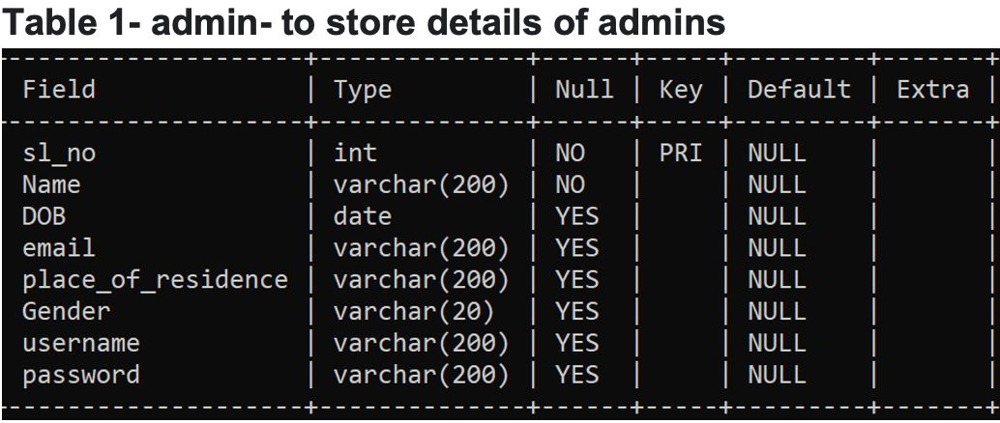
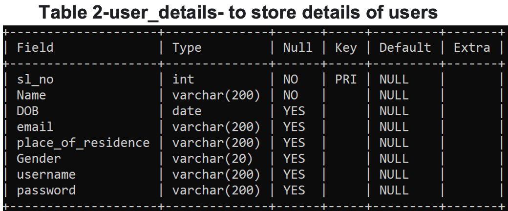
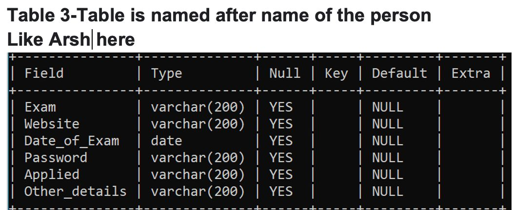

# CollegeQuest Databse System
### Use Case
A Python + MySQL-based system to help students explore, track, and manage college applications and entrance exams after 12th grade.  

## Motivation

After Class 12th, students often struggle to:
- Discover reputed colleges that align with their academics and interests
- Track entrance exams, passwords, usernames, and portals
- Collect scattered information across websites

**CollegeQuest** provides a centralized platform to solve these problems.

---

## Features

### User Functionalities

- `a`: **Create a personalized account** (track all registered exams)
- `b`: **Browse colleges** and view categorized information
- `c`: **Predict eligible colleges** based on exams you've taken
- `d`: **Browse entrance exams** (details, links, and dates)
- `e`: **View personalized exam tracker**
- `g`: **Edit personalized account info**
- `f`: **Exit** the application

### College Information Categories (via file handling)
Each college has categorized details stored in separate `.txt` files:
| Type | Description                      |
|------|----------------------------------|
| 1    | Courses Offered                  |
| 2    | Awards and Recognitions          |
| 3    | Ratings                          |
| 4    | People’s Reviews                 |
| 5    | Location                         |
| 6    | Extra-Curricular Activities      |

## Admin Functionalities

Admins have access to:
- Update user details: name, DOB, email, residence, gender, username, password
- Delete a user record from the database

## Tech Stack

- **Language**: Python 3
- **Database**: MySQL (via `mysql-connector-python`)
- **File Handling**: For college information storage
- **CLI-based Interface**: Menu-driven commands

---

### Table Used:

Database Tables used in our SQL localhost  
Code to make these table structures are given in the **admin.py** and **user_details_table.py** files.

---

### How to Use:
The `user_details.table.py` and `admin.py` scripts use `mysql.connector` to create and manage MySQL tables for users and administrators.

Download all `.txt files` from the College_files folder and place them in the same directory as your .py scripts to ensure proper file handling and access.

To get started, run `pytfile.py` in your terminal. You'll be greeted with:

> Welcome to Careers Camp

You will then be prompted to select your role:

- `User`
- `Admin`

Depending on your choice, the program will guide you through **sign in / registration**, followed by various functionalities.

